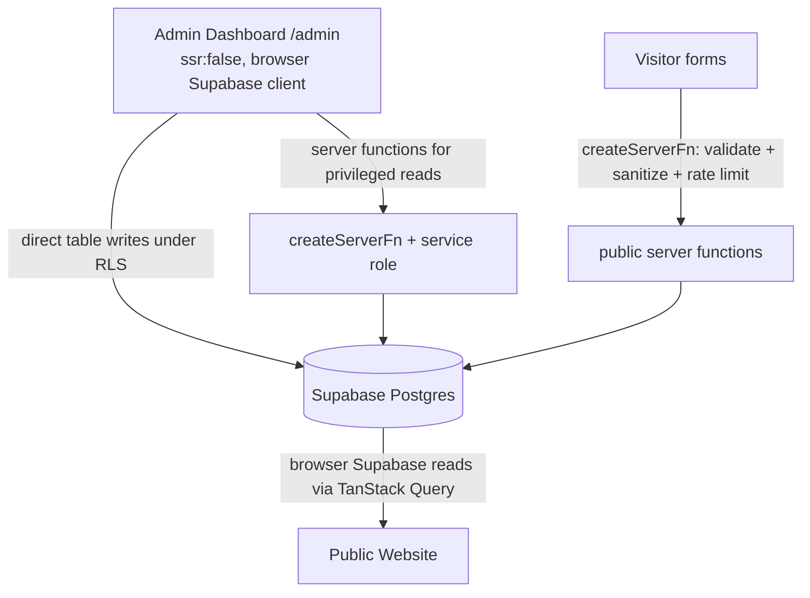

# 01 — Project Overview

## Purpose

Janat Sahara Travel is a production travel-agency platform for a Tunisian agency
selling **Umrah packages, organised trips, flight requests and visa services**.
It consists of two products sharing one database:

1. **Public website** — multilingual (Arabic / French / English) marketing and
   lead-capture site: packages catalogue, booking flow, flight-request engine,
   blog, gallery, FAQ, contact and branch map.
2. **Admin dashboard** (`/admin`) — the agency's internal "Travel Command Center":
   KPIs, insights, booking/request inboxes, CRM, trip (package) editor, content
   management and website settings.

There is **no customer account system**. Visitors never sign in. Only agency staff
authenticate, and only for `/admin`.

## Target users

- **Visitors / travellers** — browse packages, submit bookings (with passport
  upload), request flight quotes, send contact messages, subscribe to newsletter.
- **Agency staff (`admin`, `super_admin`, `staff` in code)** — process requests,
  publish packages and content, manage branches and settings.
- The agency owner receives **email notifications** for new bookings and flight
  requests; there is no payment step — the agency contacts the customer manually.

## Major modules

| Module | Entry points |
| --- | --- |
| Public site shell | `src/components/layout/SiteLayout.tsx`, `Navbar`, `Footer` |
| Homepage sections | `src/components/sections/*` (`HomeSections`, `HeroSection`, `StatsSection`, `BranchesSection`, `PackageSelector`) |
| Packages catalogue | `src/routes/umrah.tsx`, `trips.tsx`, `visa.tsx`, `packages.$slug.tsx`, `src/components/sections/PackagesPage.tsx` |
| Booking flow | `src/routes/booking.tsx`, `src/components/booking/flow/*`, `src/lib/booking.functions.ts` |
| Flight requests | `src/routes/flights.tsx`, `src/components/flights/*`, `src/lib/flight-request.functions.ts` |
| Blog | `src/routes/blog.tsx`, `blog.$slug.tsx`, `src/lib/blog.ts` |
| Contact & branches | `src/routes/contact.tsx`, `src/components/sections/BranchesSection.tsx`, `BranchesMap.tsx` |
| Admin shell & nav | `src/routes/admin.tsx`, `src/components/admin/AdminShell.tsx` |
| Command Center / reports / CRM | `src/routes/admin.index.tsx`, `admin.reports.tsx`, `admin.customers.tsx`, `src/lib/admin/dashboard.server.ts`, `crm.server.ts`, `command.functions.ts` |
| Trip editor | `src/routes/admin.packages.$id.tsx`, `src/components/admin/packages/*` |
| Content managers | `admin.blog.tsx`, `admin.gallery.tsx`, `admin.testimonials.tsx`, `admin.faq.tsx` |
| Settings | `src/routes/admin.settings.tsx`, `src/components/admin/settings/*` |
| Agent integration (MCP) | `src/routes/mcp.ts`, `src/routes/[.mcp]/*`, `src/lib/mcp/*` |

## Technology stack

- **TanStack Start v1** (React 19, SSR on a Cloudflare-Workers-style runtime) with
  **TanStack Router** file-based routing and **TanStack Query** for caching.
- **Vite 7**, **Tailwind CSS v4** (design tokens in `src/styles.css`), **shadcn/ui**
  (Radix) components in `src/components/ui`.
- **Supabase (Lovable Cloud)** — Postgres + RLS, Auth, private Storage.
- **i18next / react-i18next** — three languages, Arabic default and RTL.
- **Leaflet + react-leaflet** — branch map (client-only).
- **Resend HTTP API** — owner notification emails (called from server functions).
- **@lovable.dev/mcp-js** — MCP server exposing read/write tools to agents.
- `@tanstack/react-virtual` for the virtualized package dropdown; `date-fns`,
  `zod`, `react-hook-form`, `sonner`, `lucide-react`, `recharts`-free custom charts.

## Entry points

| Concern | File |
| --- | --- |
| Worker fetch handler / SSR wrapper | `src/server.ts` |
| Start instance, middlewares (CSRF, security headers, auth attacher) | `src/start.ts` |
| Router + QueryClient defaults | `src/router.tsx` |
| Root layout, head metadata, providers, `<Toaster />` | `src/routes/__root.tsx` |
| Generated route tree (never edit) | `src/routeTree.gen.ts` |

## Admin → Database → Public website relationship

**Nature of the relationship: request-based and client-cached — not real-time.**

- The public site reads with the **browser Supabase client** through query option
  factories in `src/lib/queries.ts`, wrapped in TanStack Query.
- `src/router.tsx` sets `staleTime: 5 min`, `gcTime: 30 min`,
  `refetchOnWindowFocus: false`, `refetchOnReconnect: false`, `retry: 1`.
  So an admin edit becomes visible to a visitor on their **next fresh fetch**
  (new page load / after staleTime), not instantly. No Supabase Realtime
  subscriptions exist anywhere in `src/`.
- There is **no build-time static generation of content pages** and no CDN cache
  layer in the repo; SSR renders per request. `KNOWN LIMITATION`: an admin
  change is not pushed to already-open visitor tabs.

## Important business concepts

- **Package** (`packages` table, called "Trip" in the newer admin UI) — the sellable
  unit, typed by `package_category` enum: `umrah | trip | flight | visa`, with
  `package_status` `draft | published | archived`. Only `published` rows are
  readable by anonymous visitors (RLS).
- **Booking** — a visitor reservation attached to a package, plus per-passenger rows
  and a private passport file. Statuses are free-text (`status` defaults to `new`).
- **Flight request** — a quote inquiry with a human-readable `reference`; status
  constrained to `new | contacted | waiting | quoted | confirmed | cancelled`.
- **Branch** — physical office shown on the public map; one row may be
  `is_main_branch`.
- **Site settings** — flat key/value store (`site_settings`) grouped by `group`,
  driving brand, SEO, contact, email and notification preferences.
- **Localized content** — every editable content table carries `_fr` and `_en`
  sibling columns; the base column is Arabic.
