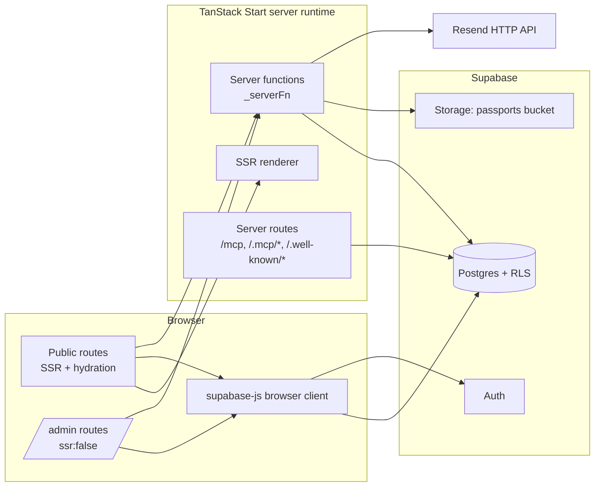

# 02 — Architecture

## High level

## Frontend architecture

- **Routing**: file-based under `src/routes`, flat dot-notation
  (`admin.packages.$id.tsx` → `/admin/packages/$id`). `src/routeTree.gen.ts` is
  generated — never edit it.
- **Root**: `src/routes/__root.tsx` provides `QueryClientProvider`,
  `ThemeProvider` (default `light`), `LanguageProvider`, sonner `<Toaster />`,
  global head metadata (title/description/OG/Twitter, Google Fonts links) and the
  localized 404 (`NotFoundComponent`) and error boundary (`ErrorComponent`, which
  also reports via `src/lib/lovable-error-reporting.ts`).
- **Public layout**: `SiteLayout` (Navbar + Footer) is composed per public route,
  not in `__root`.
- **Admin layout**: `src/routes/admin.tsx` is a layout route with `ssr: false` and
  `robots: noindex`. It gates on auth + role, then provides `AdminContext` and
  renders `AdminShell` around `<Outlet />`.
- **Component layers**:
  - `src/components/ui/*` — shadcn primitives (do not restyle ad hoc).
  - `src/components/common/*` — cross-cutting building blocks (`Logo`,
    `LazyImage`, `LazySection`, `PackageCard`, `PackageDropdown`,
    `SectionHeading`, `DynamicIcon`, `ImageLightbox`, `ArticleDialog`,
    `LanguageSwitcher`, `ThemeToggle`, `SkeletonGrid`).
  - `src/components/sections/*` — public page sections.
  - `src/components/admin/kit/index.tsx` + `ui.tsx` — the admin design kit
    (KPI cards, insight cards, page headers, tables, drawers, empty states).
- **State management**: no Redux/Zustand. State is
  1. **Server data** → TanStack Query (`src/lib/queries.ts` factories, keyed and
     invalidated by feature).
  2. **URL state** → router params/search.
  3. **Local UI state** → `useState`/`useReducer` inside components
     (`booking/flow/model.ts`, `admin/packages/model.ts` hold the form models).
  4. **Cross-tree context** → `ThemeProvider`, `LanguageProvider` (i18next),
     `AdminContext` (`src/components/admin/context.ts`).
- **Hooks**: `src/hooks/useAuth.ts` (`useAuth`, `useUserRoles`, `hasAdminRole`,
  `isSuperAdmin`), `useInView.ts` (lazy sections), `use-mobile.tsx`.
- **Styling**: Tailwind v4 with semantic tokens declared in `src/styles.css`
  (primary orange `#EE5A24`, gold `#C9982E`, dark teal surfaces; Cairo /
  IBM Plex Sans Arabic / Plus Jakarta / Inter). Components must use tokens, never
  raw color utilities.

## Backend architecture

Three distinct server surfaces:

1. **Server functions** (`createServerFn`, `@tanstack/react-start`) — typed RPC.
   - Public, unauthenticated: `src/lib/public.functions.ts`
     (`submitContactMessage`, `subscribeNewsletter`, `uploadPassport`),
     `src/lib/booking.functions.ts` (`submitBooking`),
     `src/lib/flight-request.functions.ts` (`submitFlightRequest`).
     Each one validates with zod schemas (`*.schema.ts`), sanitizes and
     rate-limits via `src/lib/security.server.ts`, then writes with the
     service-role client.
   - Authenticated: `src/lib/admin/admin.functions.ts` and
     `src/lib/admin/command.functions.ts`, all using
     `.middleware([requireSupabaseAuth])` and (for command/CRM/report loaders)
     `assertAdmin(context.userId)` from `dashboard.server.ts`.
2. **Server routes** — `src/routes/mcp.ts`, `src/routes/[.mcp]/list-tools.ts`,
   `src/routes/[.mcp]/invoke-tool/$tool.ts`,
   `src/routes/[.well-known]/oauth-protected-resource.ts`, and the OAuth consent
   route `src/routes/[.]lovable.oauth.consent.tsx`.
3. **Middleware** (`src/start.ts`): `attachSupabaseAuth` as client-side
   `functionMiddleware` (attaches the bearer token to server-function calls) and
   request middlewares `errorMiddleware` (renders `src/lib/error-page.ts` HTML on
   unhandled 500s), `createCsrfMiddleware` filtered to server functions, and
   `securityHeadersMiddleware` (`X-Content-Type-Options`, `Referrer-Policy`,
   `X-DNS-Prefetch-Control`, `Permissions-Policy`; frame options intentionally
   omitted so the Lovable preview can embed the app).

`src/server.ts` wraps the SSR entry to normalise h3-swallowed 500s into the
branded error page and logs the captured error (`src/lib/error-capture.ts`).

## Data access boundaries — which client is used where

| Client | Module | Used by | RLS |
| --- | --- | --- | --- |
| Browser client | `@/integrations/supabase/client` | public reads (`src/lib/queries.ts`, `src/lib/blog.ts`), all admin CRUD screens, `useUserRoles` | Yes (anon or signed-in user) |
| Service-role admin client | `@/integrations/supabase/client.server` (`supabaseAdmin`) | public write server functions, `src/lib/admin/dashboard.server.ts`, `crm.server.ts`, `security.server.ts`, admin server functions (imported **inside** handlers) | Bypassed |
| Auth middleware client | `@/integrations/supabase/auth-middleware` (`requireSupabaseAuth` → `context.supabase`, `context.userId`) | protected server functions | Yes, as the caller |

These integration files are auto-generated — **do not edit them**.

`KNOWN LIMITATION`: admin CRUD screens write directly from the browser with the
user's token, so authorization for those tables is enforced purely by RLS
(`has_role(auth.uid(),'admin')`), not by server code.

## Storage architecture

- Single private bucket **`passports`**.
- Upload path is generated **server-side** in `uploadPassport`
  (`src/lib/public.functions.ts`); the client sends base64 (`src/lib/upload.ts`,
  max 8 MB, jpeg/png/webp/heic/pdf) and never chooses the path.
- Admin viewing goes through `getPassportSignedUrl` (authenticated server
  function) which mints a short-lived signed URL with the service role.
- Booking notification emails embed a signed passport link generated in
  `submitBooking`.
- Admin media uploads for content images use `src/lib/admin/media.ts`.

## Server / client boundary rules in force

- `*.server.ts` files (`security.server.ts`, `booking-email.server.ts`,
  `flight-request-email.server.ts`, `admin/dashboard.server.ts`,
  `admin/crm.server.ts`) are never imported from components; they are pulled in
  with dynamic `await import()` inside server-function handlers.
- `process.env` is read **inside handlers only** (`RESEND_API_KEY`,
  `RESEND_FROM_EMAIL`, `BOOKING_NOTIFICATION_EMAIL`, Supabase server vars).
- Leaflet is loaded client-side only in the branch map component.
- `/admin` opts out of SSR entirely (`ssr: false`) because it depends on the
  browser Supabase session.

## Deployment architecture

Lovable builds with Vite and deploys the Worker bundle; `src/server.ts` is the
fetch entry. Preview and production share the same Supabase project. There is no
Dockerfile, CI workflow, or custom deploy script in the repo —
publishing is done through Lovable. `KNOWN LIMITATION`: unprefixed secrets
changed in the dashboard require a re-publish to reach production.
