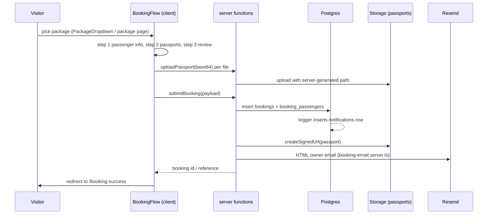

# 07 — Workflows

## Booking

Implementation details:

- UI: `src/components/booking/flow/BookingFlow.tsx` — a 3-step flow
  (`details`, `passports`, `review`) with a `StepIndicator`, per-step validation,
  and a **localStorage draft** (`slug`, `step`, `counts`, `passengers`,
  `communication`, `notes`) restored on mount (`step` clamped to 0..2).
  Supporting files: `flow/model.ts` (types + reducer-ish state), `flow/parts.tsx`.
- Fields intentionally **removed** from the form: passport number, nationality,
  date of birth, passport expiry, emergency contact. Do not reintroduce them.
- Validation schema: `src/lib/booking.schema.ts` (zod, also used server-side).
- Server: `src/lib/booking.functions.ts` → validate, sanitize, rate limit, insert
  `bookings`, insert `booking_passengers`, mint a signed passport URL, send the
  Resend email rendered by `src/lib/booking-email.server.ts`.
- Email is **best-effort**: if `RESEND_API_KEY` or `BOOKING_NOTIFICATION_EMAIL` is
  missing the function logs a warning and still succeeds
  (`KNOWN LIMITATION`: a booking can exist without the owner being emailed).
- No payment step anywhere. `payment_status` / `paid_amount` are maintained
  manually by staff in the admin.
- The visitor's active locale is captured with the submission so the owner email
  states the customer's language.

## Passport upload

- Client: `src/lib/upload.ts` — `MAX_PASSPORT_BYTES` 8 MB, allowed types
  jpeg/png/webp/heic/pdf, `fileToBase64` chunked encoding.
- Server: `uploadPassport` in `src/lib/public.functions.ts` — rate limit
  (20 / hour / IP), re-validates size/type, generates the storage path itself, and
  uploads with the service role to the private `passports` bucket.
- Admin retrieval: `getPassportSignedUrl` (authenticated).

## Flight request

- UI: `src/routes/flights.tsx` + `src/components/flights/FlightRequestSection.tsx`
  with `AirportCombobox.tsx` (airport data in `src/lib/airports.ts`).
- Schema: `src/lib/flight-request.schema.ts` (includes `cabinLabel` helpers and the
  submitter `locale`).
- Server: `submitFlightRequest` — rate limit 5 / 15 min, sanitize, generate a
  human-readable `reference`, insert into `flight_requests` (service role: there is
  no anon insert policy), then email the agency via Resend using
  `src/lib/flight-request-email.server.ts`.
- Admin: `admin.flight-requests.tsx` manages the status pipeline
  `new → contacted → waiting → quoted → confirmed | cancelled`, with
  `internal_notes`, `assigned_to`, `admin_reply`, `completed_at` and export.

## Contact message

- UI: contact form on `/contact` and inside `BranchesSection`.
- Server: `submitContactMessage` — rate limit 5 / 10 min per IP, sanitizes name,
  email, phone, subject, message (length-capped), inserts into `contact_messages`.
- A DB trigger inserts a `notifications` row.
- Admin: `admin.messages.tsx` toggles `handled`.

## Newsletter

- UI: footer form. Server: `subscribeNewsletter` — rate limit 5 / 10 min, sanitized
  email, insert into `newsletter_subscribers` (duplicate handling per the function's
  upsert/ignore logic). Admin read-only via RLS policy; no sending/campaign feature
  exists (`NOT CONNECTED` to any email provider).

## Notifications

- Source: Postgres triggers insert into `public.notifications` for new bookings and
  new contact messages (`kind`, `title`, `body`, `entity`, `entity_id`).
  Flight requests are inserted by the service-role server function —
  `UNKNOWN — VERIFY IN CODE` whether the trigger list covers `flight_requests`.
- Consumption: `AdminShell` polls unread counts (`notifications`, `bookings`,
  `flight_requests`, `contact_messages` HEAD count queries);
  `admin.notifications.tsx` lists up to 200 rows, marks read
  (`read_at`), marks all read, deletes.
- The `notify_*` settings keys do not gate any of this: `NOT CONNECTED`.

## Rate limiting & sanitization (shared)

`src/lib/security.server.ts`:

- `getClientIp()` — `cf-connecting-ip` → `x-real-ip` → first `x-forwarded-for`.
- `enforceRateLimit({ scope, limit, windowSeconds, identifier })` — fixed window
  counted in `public.rate_limits` with the service role; **fails open** on
  infrastructure errors so an outage cannot block bookings (`KNOWN LIMITATION`).
- `sanitizeText`, `sanitizeOptionalText`, `sanitizeEmail`, `sanitizeHeaderValue`,
  plus upload validation helpers. Every public write goes through these.

Current limits: contact 5/10 min, newsletter 5/10 min, flight request 5/15 min,
passport upload 20/hour.

## Publishing content

There is no editorial workflow engine. "Publishing" = flipping a row flag:

| Table | Flag |
| --- | --- |
| `packages` | `status = 'published'` (`draft`, `archived` hidden) |
| `articles` | `published = true` (+ `published_at`) |
| `gallery_items`, `testimonials`, `faqs`, `services`, `features` | `active = true` |
| `branches` | `is_active = true` |

RLS enforces the same predicate, so an unpublished row is unreachable for anonymous
visitors even if a query forgot the filter. Visibility on the public site follows the
TanStack Query cache window described in `01-project-overview.md`.
